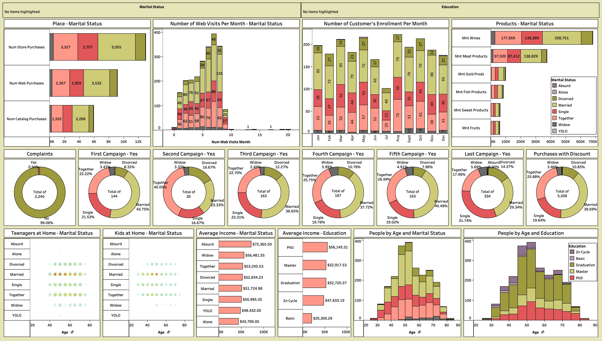

# Customer Personality Analysis Dashboard

## Overview
This project presents an interactive Tableau dashboard built to analyze customer behavior, demographics, and purchasing patterns. The goal is to extract meaningful insights that can help businesses understand their customers better and improve decision making.

---

## Dashboard Features

- Customer segmentation based on **marital status and education**
- Analysis of **web visits, purchases, and campaign responses**
- Insights into **product spending categories** (wines, meat, fruits, etc.)
- Visualization of **income distribution across demographics**
- Campaign performance analysis (1st to last campaign)
- Age distribution analysis across different customer groups

---

## Key Insights

- Married customers contribute the highest overall purchases across multiple product categories
- Web visits show a strong correlation with customer engagement and conversions
- Campaign responses vary significantly across different marital segments
- Higher education levels tend to correlate with higher average income
- Most customers fall within the middle age group (40–65), indicating a mature customer base

---

## Tools & Technologies

- Tableau (Data Visualization)
- Data Analytics & Dashboard Design

---

## File Information

- `Customer-Personality-Analysis.twbx`  
  Packaged Tableau Workbook containing the dashboard along with the dataset.

---

## How to Use

1. Download the `.twbx` file
2. Open it using **Tableau Desktop** or **Tableau Public**
3. Interact with filters (marital status, education, etc.) to explore insights

---

## Dashboard Preview

---

## Author

Agrim Kumar Malhotra  

---
