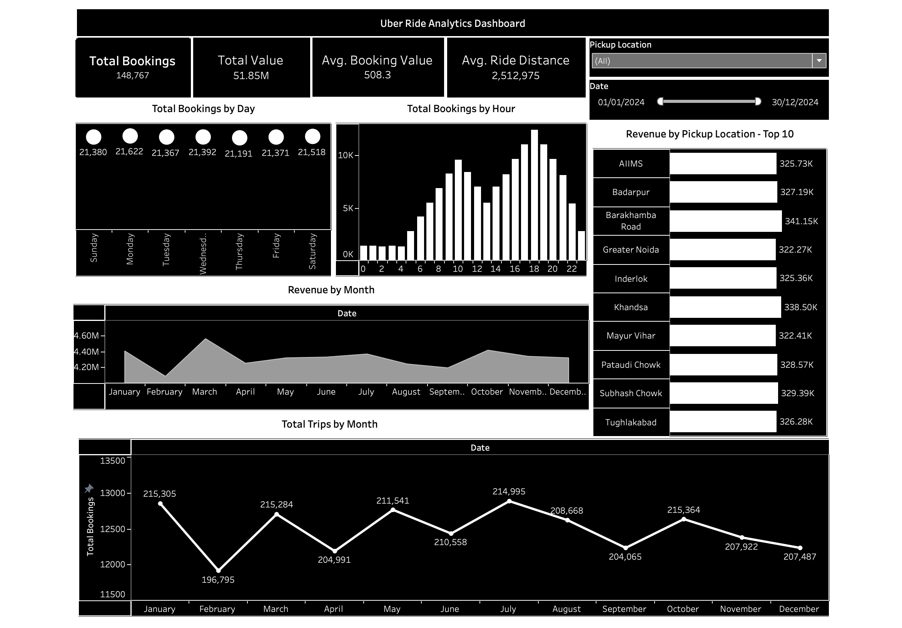

# Uber Ride Analytics Dashboard

An interactive data analytics dashboard built using Tableau to analyze Uber ride data.  
The dashboard provides insights into bookings, revenue trends, ride patterns, and location-based performance to support data-driven decision-making.

---

## Features

- Total Bookings, Total Revenue, and Average Ride Metrics  
- Ride trends by hour and day  
- Revenue and bookings by location  
- Monthly performance analysis  
- Interactive filters for deeper insights  

---

## Tools & Technologies

- Tableau (Data Visualization)  
- CSV ([Data Source](https://www.kaggle.com/datasets/yashdevladdha/uber-ride-analytics-dashboard))  

## Objective

To analyze ride-hailing data and uncover key insights related to customer demand, revenue generation, and operational performance.

---

## Key Insights

- Peak booking hours observed during high-demand time slots  
- Certain locations generate higher revenue consistently  
- Weekly and monthly trends highlight usage patterns  

---

## Future Improvements

- Add predictive analytics (demand forecasting)  
- Integrate real-time data  
- Enhance UI/UX for better usability  

---

# Uber Ride Analytics Dashboard

---
## Author

Agrim Kumar Malhotra  

---

